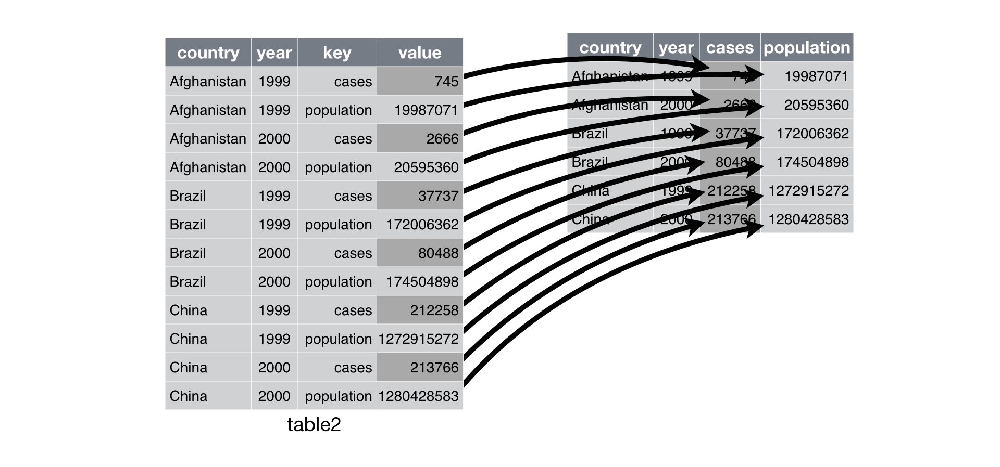

# Introducción

R es un ambiente de programación formado por un conjunto de herramientas flexibles que pueden utilizarse fácilmente mediante paquetes, librerías (9000+) o definiendo funciones propias

-   Código abierto, gratuito y de open source. Además es una herramienta estadística estable, confiable y a la vanguardia, ya que está sometida a una actualización permanente

Es un lenguaje de programación estadístico, gratuituo y open source.

## ¿Por qué R?

Actualmente, se está conviertiendo en un lenguaje muy popular y de gran relevancia. Es considerado uno de los mejores lenguajes para hacer Data Science.

Veáse en:

-   [Towards Data Science](https://towardsdatascience.com/top-9-languages-for-data-science-in-2020-824239f930c)

-   [The Most Popular Programming Languages](https://statisticsanddata.org/most-popular-programming-languages/)

## Primeros pasos

Instala Tidyverse:

``` {.r}
install.packages('tidyverse')
```

Si ya lo tienes instalado nada más hazlo llamar como:

```{r intro, echo=TRUE}
library(tidyverse)

```

Te recomiendo los siguientes pasos:

1.  Entra a **Tools**

2.  **Global Options**

3.  En **Workspace** desactiva donde dice: Restore .RData into workspace at startup

4.  En **Workspace** donde dice Save workspace to .RData when exit activa **never**.

## Paquetes

-   Base R: ya instalados cuando bajamos R

-   Contribuited packages: códigos de R que todos pueden bajar y obtener más funciones

Paquetes que vamos a usar:

``` {.r}
library(dplyr) # Manipular bases de datos
library(tidyr) # Limpiar informatción
library(stringr) # Trabajar con strings o texto
library(lubridate) # Trabajar con fechas y horas
library(ggplot2) # Paquete más común para hacer gráficas
library(rmarkdown) # Reportes
```

Entre otros.

## Tipos de datos

| Datos     | Valores            |
|-----------|--------------------|
| Logic     | True, False        |
| Numeric   | 1, 2, 10000, 1e10  |
| Integer   | 3L, 4L, 40L        |
| Character | 'a', 'Hello World' |

## Workflow

-   Rproject

-   Estructura de carpetas

-   ETL


-   El proceso de **tidy** consume alrededor del 70% u 80% del tiempo de un *Data Scientist*.

### Operaciones logicas


### Funciones dplyr

``` {.r}
filter() # Seleccionar observaciones por sus valores
arrange() # Reordenar columnas
select() # seleccionar distintas columnas
mutate() # Crear una nueva variable a partir de variables existentes o columnas existentes
summarise() # Colapsar muchas observacioines en una sola
group_by() # Group-by-group
```

# Data Wrangling

Adaptar tus datos para que sean útiles para visualizar y modelar.

###  Import data

``` {.r}
dataset <- read_csv("data/raw/dataset.csv")
```

### Tidy

1.  Cada variable es una columna.

2.  Cada observación es un renglón.

3.  Cada variable es un valor tiene su propia celda.


### Pivoting

Normalmente, nos vamos a encontrar con datos no limpios, por lo que primero hay que adaptar los datos.

\#\#\#\#Pivot longer

 Un caso común en donde hay columnas que en realidad son parte de una variable. Por lo que vamos a utilizar una función:

``` {.r}
pivot_longer(, names_to = , values_to = )
```

\#\#\#\#Pivot wider  Otro caso común es cuando tenemos una observación a través de varios renglones.

``` {.r}
pivot_longer(names_from = ,values_from = )
```

### Otras funciones de limpieza

-   Separate
-   Unite

## Mutating joins

Las bases de datos, entre sus variables, tienen **llaves primarias**, las cuales van a ayudar a distinguir a cada observación como única, como nuestra *clave única* en el ITAM.

**Inner join**


**Outer joins**


